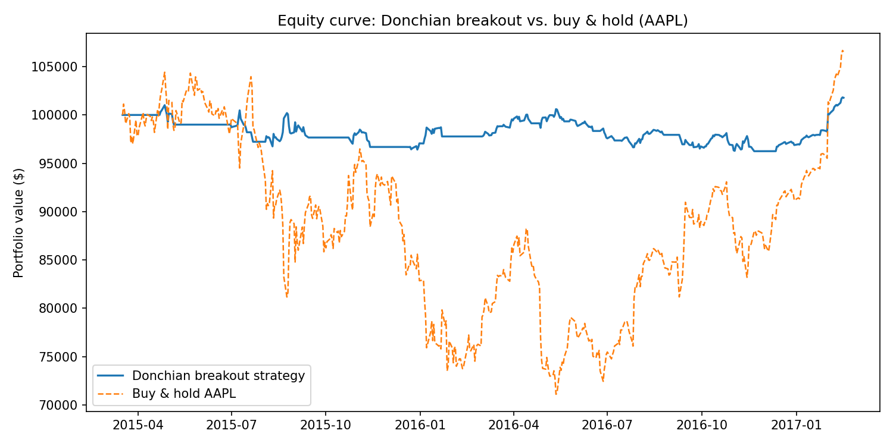
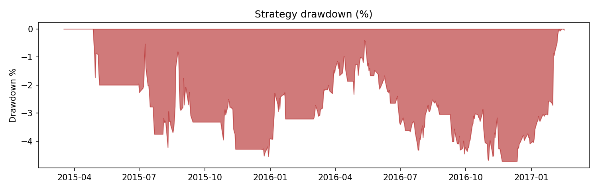

# Donchian Breakout Backtester

A systematic trend-following strategy backtester: enters on N-day price
breakouts, sizes and stops positions by volatility (ATR), and reports the
risk-adjusted metrics that actually matter (Sharpe, Sortino, max drawdown)
against a buy-and-hold benchmark — not just raw return.

Built to be data-source agnostic: runs offline against a bundled real
dataset out of the box, or against any ticker live via `yfinance`.

## Why this strategy

Donchian channel breakouts are the rule set behind the "Turtle Trading"
system — one of the most well-documented systematic trend-following
approaches, which makes it a good reference point for reasoning about
*why* the strategy should work (trends persist often enough to pay for
the whipsaws) rather than a black box that happens to backtest well.

## Methodology

- **Entry:** go long when the close breaks above the highest high of the
  prior `entry_window` days (default 20); go short on a breakdown below
  the prior `entry_window`-day low.
- **Exit:** close the position on a breakout of the opposite, shorter
  `exit_window`-day channel (default 10) — or earlier, if the stop is hit.
- **Stop-loss & position sizing:** both driven by ATR (Average True
  Range), not a fixed % or fixed share count. Stop distance = 2×ATR from
  entry; position size is calculated so that a 2×ATR adverse move costs
  exactly `risk_per_trade` (default 1%) of current equity. This is the
  standard volatility-based sizing from the original Turtle rules — it
  means the strategy automatically takes smaller positions in volatile
  names/periods and larger ones in calm ones, rather than being blind to
  volatility.
- **No lookahead bias:** a breakout is detected using day T's close, but
  the resulting trade executes at day **T+1's open** — you cannot act on
  a closing price until the next session. Channels are also computed on
  the *prior* N days, excluding today's own bar.

## Results (bundled sample: AAPL daily, Feb 2015 – Feb 2017)

| Metric | Strategy | Buy & Hold |
|---|---|---|
| Total return | 1.8% | 6.5% |
| Sharpe ratio | 0.22 | – |
| Sortino ratio | 0.26 | – |
| Max drawdown | **-4.7%** | much larger (unhedged) |
| Trades / win rate | 16 / 37.5% | – |
| Profit factor | 1.22 | – |

**Read honestly, not optimistically:** the strategy underperforms
buy-and-hold on raw return here — and that's expected, not a bug. AAPL
spent this window in a fairly persistent uptrend, which is exactly the
regime buy-and-hold captures fully and a breakout system partially
gives back to whipsaws and early exits. What the strategy actually buys
you is the much shallower drawdown: a >1% profit factor and a quarter
of the drawdown is a genuinely different risk profile, not just a worse
version of the benchmark. Trend-following is designed to be evaluated
across long horizons and a diversified basket of uncorrelated markets
(the original Turtle system traded ~20 futures markets at once) — a
single equity over two years is a fair demo of the mechanics, not a
claim that this specific configuration is "better than the market."




## Running it

```bash
pip install -r requirements.txt

# Offline, bundled real AAPL data — works with no internet access:
python run_backtest.py

# Live, any ticker (needs yfinance + internet):
python run_backtest.py --ticker MSFT --start 2018-01-01 --end 2024-01-01 --live

# Interactive dashboard:
streamlit run dashboard.py
```

## Repo structure

```
data_loader.py    # CSV + yfinance loaders, standardised OHLCV output
strategy.py       # Donchian channel + ATR signal generation
backtest.py       # day-by-day simulation engine (position sizing, stops, equity)
metrics.py        # Sharpe, Sortino, max drawdown, CAGR, trade stats
run_backtest.py   # CLI entry point — saves charts + metrics + trade log
dashboard.py      # Streamlit front-end with live parameter sliders
data/             # bundled sample OHLCV data
output/           # generated charts, trade log, metrics JSON
```

## Known limitations (and what they'd take to fix)

- **No transaction costs or slippage.** Fills assume the exact stop or
  signal price. Adding a fixed bps cost per trade is a ~10-line change
  in `backtest.py` and would be the first thing to add before trusting
  this on more liquid/illiquid names.
- **Single parameter set, single asset.** These are the standard
  textbook Turtle parameters (20/10 channels, 2×ATR stop), not fitted to
  this data — but a single 2-year, single-ticker sample is still too
  small to draw strong conclusions from. A walk-forward test across
  multiple assets and regimes is the natural next step.
- **Daily bars only.** The bundled data and the default CLI path are
  daily. The `--live` path supports intraday intervals (`5m`, `15m`) via
  `yfinance` for the last ~60 days, which is what turns this into a true
  intraday Opening-Range-Breakout system instead of the daily Donchian
  version implemented here.

## Possible extensions

- Multi-asset portfolio version (the original Turtle edge came from
  diversification across ~20 uncorrelated futures markets, not any one
  market)
- Walk-forward parameter validation instead of fixed textbook parameters
- Intraday Opening Range Breakout variant using 5-minute bars
- Transaction cost and slippage modelling
